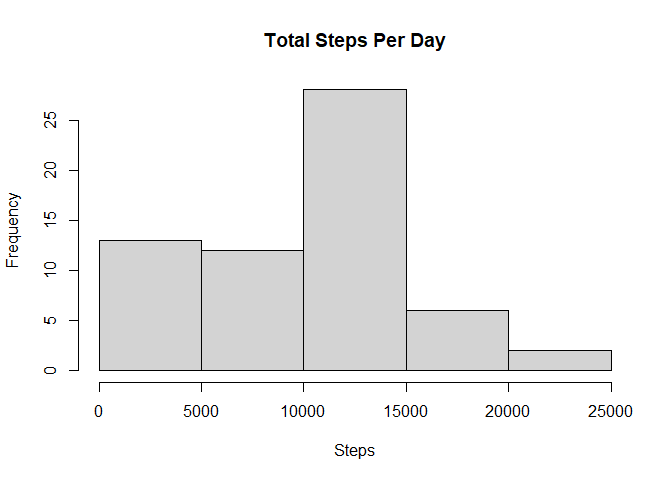
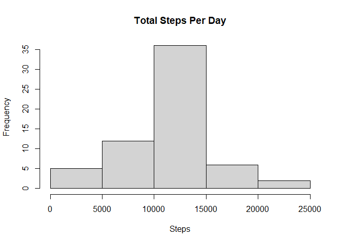
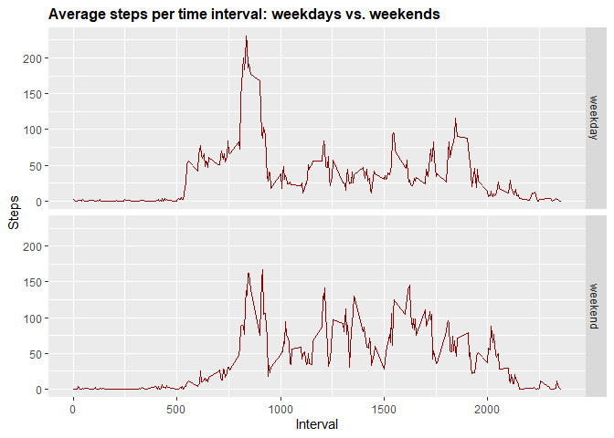

## Loading and preprocessing the data

```r
library(readr)
library(lubridate)

activity <- read_csv("activity.csv")
activity$date <- ymd(activity$date)
activity$day <-weekdays(as.Date(activity$date))

summary(activity)
```

```
##      steps             date               interval          day           
##  Min.   :  0.00   Min.   :2012-10-01   Min.   :   0.0   Length:17568      
##  1st Qu.:  0.00   1st Qu.:2012-10-16   1st Qu.: 588.8   Class :character  
##  Median :  0.00   Median :2012-10-31   Median :1177.5   Mode  :character  
##  Mean   : 37.38   Mean   :2012-10-31   Mean   :1177.5                     
##  3rd Qu.: 12.00   3rd Qu.:2012-11-15   3rd Qu.:1766.2                     
##  Max.   :806.00   Max.   :2012-11-30   Max.   :2355.0                     
##  NA's   :2304
```


## What is mean total number of steps taken per day?


```r
library(tidyverse)

# Calculating total steps per day
steps_per_day <- activity %>% 
        group_by(date) %>% 
        summarise(total_steps = sum(steps, na.rm = TRUE))

colnames(steps_per_day) <- c("Date", "Steps")

print(steps_per_day)
```

```
## # A tibble: 61 x 2
##    Date       Steps
##    <date>     <dbl>
##  1 2012-10-01     0
##  2 2012-10-02   126
##  3 2012-10-03 11352
##  4 2012-10-04 12116
##  5 2012-10-05 13294
##  6 2012-10-06 15420
##  7 2012-10-07 11015
##  8 2012-10-08     0
##  9 2012-10-09 12811
## 10 2012-10-10  9900
## # ... with 51 more rows
```

Creating histogram of total number of steps taken each day


```r
hist(steps_per_day$Steps, breaks = 5, xlab = "Steps", main = "Total Steps Per Day")
```

<!-- -->


```r
mean_steps <- mean(steps_per_day$Steps, na.rm = TRUE)

median_steps <- median(steps_per_day$Steps, na.rm = TRUE)
```

The mean and median number of steps taken per day are 9354.2295082 and 1.0395\times 10^{4} respectively.


## What is the average daily activity pattern?


```r
library(tidyverse)

daily_pattern <- activity %>% 
        group_by(interval) %>% 
        summarise(average = mean(steps, na.rm = TRUE))


p <- ggplot(daily_pattern, aes(x=interval, y=average), xlab = "Interval", ylab="Average Number of Steps")

p + geom_line()+xlab("Interval")+ylab("Average Number of Steps")+ggtitle("Average Number of Steps per Interval")
```

<!-- -->


```r
max_steps_interval <- which.max(daily_pattern$average)

max_steps <- daily_pattern$interval[max_steps_interval]
```

The 5-minute interval which had the maximum number of steps is 835 interval.


## Imputing missing values


```r
missing <- sum(is.na(activity$steps))
```

Total number of rows with missing values is 2304.


The strategy for filling missing values will be to substitute missing steps with average steps for that interval.


```r
library(tidyverse)

StepsPerInterval <- tapply(activity$steps, activity$interval, mean, na.rm = TRUE)
# split activity data by interval
activity_split <- split(activity, activity$interval)
# fill in missing data for each interval
for(i in 1:length(activity_split)){
    activity_split[[i]]$steps[is.na(activity_split[[i]]$steps)] <- StepsPerInterval[i]
}
activity_imputed <- do.call("rbind", activity_split)
activity_imputed <- activity_imputed[order(activity_imputed$date) ,]

activity_imputed$steps <- ceiling(activity_imputed$steps)
```


  
First ten rows of new data set is shown below:


```r
head(activity_imputed, 10)
```

```
## # A tibble: 10 x 4
##    steps date       interval day   
##    <dbl> <date>        <dbl> <chr> 
##  1     2 2012-10-01        0 Monday
##  2     1 2012-10-01        5 Monday
##  3     1 2012-10-01       10 Monday
##  4     1 2012-10-01       15 Monday
##  5     1 2012-10-01       20 Monday
##  6     3 2012-10-01       25 Monday
##  7     1 2012-10-01       30 Monday
##  8     1 2012-10-01       35 Monday
##  9     0 2012-10-01       40 Monday
## 10     2 2012-10-01       45 Monday
```

Creating Histogram for total number of steps per day


```r
library(tidyverse, quietly = TRUE)
total_steps_per_day <- activity_imputed %>% 
        group_by(date) %>% 
        summarise(total_steps = sum(steps))

colnames(total_steps_per_day) <- c("Date", "Steps")

hist(total_steps_per_day$Steps, breaks = 5, xlab = "Steps", main = "Total Steps Per Day")
```

<!-- -->


```r
mean_step <- mean(total_steps_per_day$Steps, na.rm = TRUE)

median_step <- median(total_steps_per_day$Steps, na.rm = TRUE)
```

The mean and median number of steps taken per day are 1.0784918\times 10^{4} and 1.0909\times 10^{4} respectively.


The mean number of daily steps has changed a little but median remains almost same.
However, the overall shape of the distribution has not changed.

## Are there differences in activity patterns between weekdays and weekends?


```r
activity_imputed$day_type <- ifelse(activity_imputed$day == "Saturday"|activity_imputed$day == "Sunday", "weekend", "weekday")

activity_imputed$day_type <- as.factor(activity_imputed$day_type)
```


```r
# create table with steps per time across weekdaydays or weekend days

StepsPerTimeDT <- aggregate(steps ~ interval + day_type, data=activity_imputed, FUN=mean, na.action=na.omit)


# draw the line plot
j <- ggplot(StepsPerTimeDT, aes(interval, steps))
j+geom_line(col="darkred") + ggtitle("Average steps per time interval: weekdays vs. weekends") + xlab("Interval") + ylab("Steps") + theme(plot.title = element_text(face="bold", size=12)) + facet_grid(day_type ~ .)
```

<!-- -->


The step activity trends are different based on whether the day occurs on a weekend or not. This may be due to people having an increased opportunity for activity beyond normal work hours for those who work during the week.
